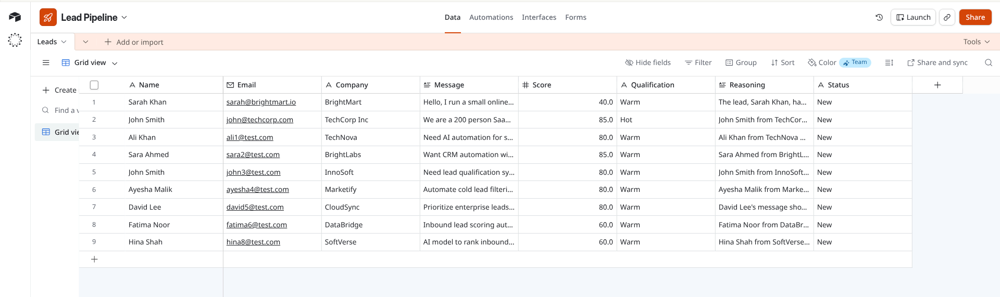
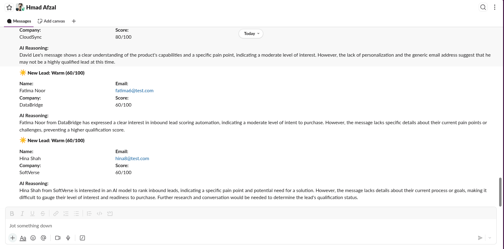
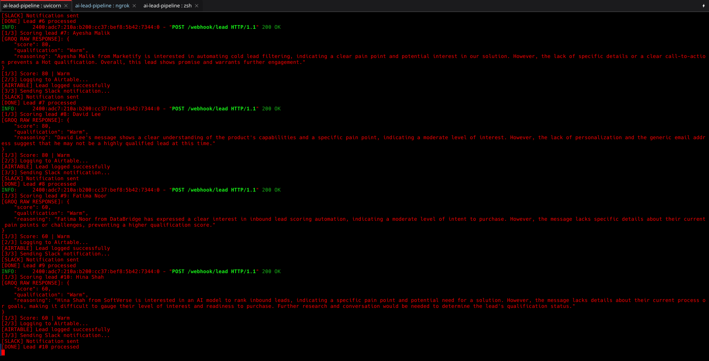
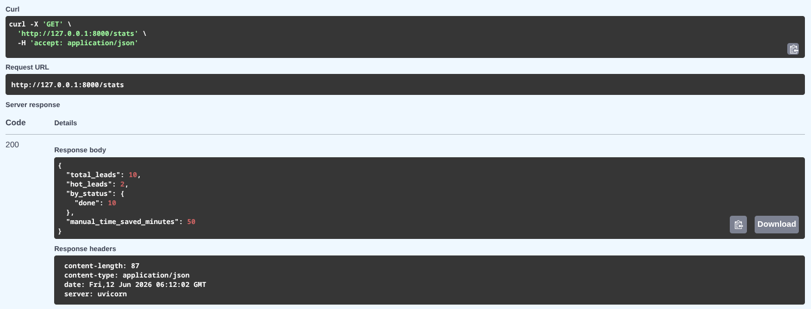

# AI Lead Qualification Pipeline

I didn't have a good automation project I could show, so I built this. It's a lead qualification system that takes the most tedious part of sales, reading, scoring leads and handling them automatically.

Here's what it does: A lead comes through your form. Normally, someone spends 3–5 minutes reading it, scoring it, logging it to your CRM, and notifying the team. This pipeline does all of that in about 5 seconds. Automatically. No human involved.

---
## Quick Navigation
 
**REWORK Eval Questions:**
- [Feature 1: Verifiable Project Review](#proof--evidence)
- [Feature 2: Error Handling Architecture](#error-handling-architecture)
- [Feature 3: Asynchronous Documentation](#asynchronous-documentation)
- [Feature 4: Timeout Fix](#the-timeout-problem--how-i-fixed-it)
---

## Proof & Evidence

Before I walk you through the details, here's the proof:

**Screenshots:**
- Airtable records with AI scores
- Real Slack alerts with lead data + AI reasoning
- Processing logs showing Step 1/3 → Step 2/3 → Step 3/3 → DONE
- Shows /stats output with lead count, qualification breakdown, time saved

**[View all screenshots below ↓](#evidence-checklist)**

**The Stack:**
- FastAPI (webhook handler)
- SQLite (persistent database)
- Groq AI (lead scoring)
- Airtable (CRM storage)
- Slack (team notifications)

**Verifiable ROI Metric:**
- Manual lead review: 3–5 minutes per lead
- Automated review: ~5 seconds per lead
- Time saved: 97% faster
- For 100 leads/week: Saves 8+ hours/week (one full workday)
- For 500 leads/week: Saves 40+ hours/week (one full-time employee)
---

## How It Actually Works

A potential customer fills out your form. 
This hits the webhook, saves the lead to a database immediately and response sent back to the form in immediately. Meanwhile, in the background, completely separate from that HTTP request, the actual pipeline works.


---

## Error Handling Architecture

Here's how the system handles failures and prevents data loss when services become unavailable.

### How the System Handles API Failures

```
Lead arrives & gets saved to SQLite immediately
(Source of truth — lead is safe)
        ↓
Background Worker starts processing
        ↓
        ┌─────────────────────────────────────┐
        │ ATTEMPT 1: Call Groq AI for scoring │
        └──────────────┬──────────────────────┘
                       │
            ┌──────────┴──────────┐
            ↓                     ↓
         SUCCESS            FAILS (timeout, rate limit, error)
            │                     │
            │              Wait 1 second
            │                     │
            │         ┌──────────────────────────┐
            │         │ ATTEMPT 2: Call Groq AI  │
            │         └──────────┬───────────────┘
            │                    │
            │         ┌──────────┴──────────┐
            │         ↓                     ↓
            │      SUCCESS            FAILS AGAIN
            │         │                     │
            │         │              Wait 2 seconds
            │         │                     │
            │         │         ┌──────────────────────────┐
            │         │         │ ATTEMPT 3: Call Groq AI  │
            │         │         └──────────┬───────────────┘
            │         │                    │
            │         │         ┌──────────┴──────────┐
            │         │         ↓                     ↓
            │         │      SUCCESS            FAILS 3 TIMES
            │         │         │                     │
            └─────────┴────┐    │                     │
                           ↓    ↓                     ↓
                      Move to Step 2            Mark as FAILED
                  (Log to Airtable)             in SQLite
                           │                     │
                    ┌──────┴────────┐             │
                    ↓               ↓             │
                 SUCCESS          FAILS      Send Slack Alert:
                    │                │       "Lead John Smith failed"
                    │          Move to       │
                    │          FAILED        Team can click to retry
                    │                │       OR fix the issue
                    │         ┌──────┘
                    │         ↓
                    │      Move to Step 3
                    │  (Send Slack notification)
                    │         │
                    │    ┌────┴────┐
                    │    ↓         ↓
                    │ SUCCESS    FAILS
                    │    │          │
                    │    │    Retry 3x
                    │    │    If all fail:
                    │    │    Mark as failed
                    │    │
                    └────┴──→ Update SQLite
                              Status = DONE
                              
(At any point, if server crashes, unfinished leads
 are automatically recovered on restart)
```

### How This Prevents Data Loss

Let’s take a single scenario: Airtable is slow or temporarily unavailable during lead processing.

Without persistence and retries, the webhook waits on Airtable as part of the request flow. If Airtable is slow, the request eventually times out, and the lead is not stored anywhere. In this case, the data is lost.

With persistence and retry logic, the lead is first written immediately to SQLite, before any external API calls. Processing then continues asynchronously. If the Airtable request fails or is slow, the worker automatically retries using backoff (1s, then 2s, etc.). Once Airtable becomes responsive again, the lead is successfully logged.

If Airtable is completely down, the system still does not lose the lead. It remains stored in SQLite with a “failed” status, Slack alerts notify the team, and it can be retried later manually. The key difference is that the data is always persisted before any external dependency is called.

---

## Asynchronous Documentation

### Simple Version

**What it does:** When a customer fills out your form, an AI reads their message and decides if they're a good fit for you (Hot/Warm/Cold). Then it puts them in your CRM and alerts your sales team. All automatic. All in a few seconds.

**What you used to do:** Someone reads the email. Decides if it's worth pursuing. Logs it to Airtable. Sends a Slack message. Takes 3–5 minutes per lead.

**What you do now:** The system does all of that in 5 seconds. Your team jumps on hot leads instantly.

**Why it matters:** If you're getting 100 leads a week, that's one person's full-time job just reading emails. This frees them up to actually talk to customers.

**What if something breaks?** The system automatically retries and alerts you. No leads are ever lost. Even if the server crashes, leads are recovered automatically.

### Why We Built It This Way

- **Fast:** Leads get scored in seconds, not minutes
- **Reliable:** Can't lose a lead even if something fails
- **Simple:** No meetings needed. It just works in the background
- **Visible:** Everything shows up in tools you already use (Airtable, Slack)

---


Here's what happens when you submit a test lead:

```bash
curl -X POST https://your-public-url/webhook/lead \
  -H "Content-Type: application/json" \
  -d '{
    "name": "Sarah Chen",
    "email": "sarah@acmecorp.com",
    "company": "Acme Corp",
    "message": "Interested in your platform for our 150-person team. Budget approved. Can we schedule a demo?"
  }'
```

**Response:**
```json
{
  "status": "received",
  "lead_id": 42,
  "message": "Lead from Sarah Chen is being processed"
}
```

Then, a few seconds later:
- Airtable shows a new record with a score of 88 (Hot)
- Notification is sent on slack

---


## Getting Started

**1. Clone the repo**
```bash
git clone <repo-url>
cd ai-lead-pipeline
python -m venv venv
source venv/bin/activate
pip install -r requirements.txt
```

**2. Add your API keys**
```bash
cp .env.example .env
# Fill in GROQ_API_KEY, AIRTABLE_API_KEY, AIRTABLE_BASE_ID, SLACK_WEBHOOK_URL
```

**3. Start the server**
```bash
uvicorn main:app --reload
```

**4. Make it public**
```bash
ngrok http 8000
```

**5. Test it**
```bash
curl -X POST https://your-ngrok-url/webhook/lead \
  -H "Content-Type: application/json" \
  -d '{"name": "Test", "email": "test@example.com", "company": "Test Co", "message": "Testing this"}'
```

---

## The Endpoints You Can Use

**POST /webhook/lead** — submit a new lead
**GET /stats** — see how many leads you've processed and time saved
**GET /leads/failed** — see any leads that failed processing
**POST /leads/{id}/retry** — manually retry a failed lead
**GET /health** — check if the system is running

---

## Evidence Checklist

All proof is in this repo:

**Visual Proof (Screenshots):**

### Airtable CRM Records


---

### Slack Notifications


---

### Terminal Processing Logs


---

### Stats Endpoint Output



**Code:**
- `main.py` — FastAPI webhook + background worker
- `db.py` — SQLite persistence + recovery logic
- `services/groq_service.py` — AI scoring with retry logic
- `services/airtable_service.py` — CRM logging with error handling
- `services/slack_service.py` — Notifications with fallback

All code is production-grade, transparent, and ready to run.